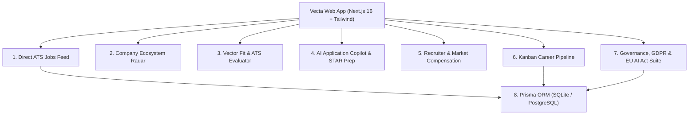

# 🧭 Vecta // Recruitment Intelligence & Career Vector Navigator

[](https://nextjs.org/)
[](https://www.typescriptlang.org/)
[](https://tailwindcss.com/)
[](https://www.prisma.io/)
[](https://artificialintelligenceact.eu/)
[](https://gdpr-info.eu/)
[](https://opensource.org/licenses/MIT)

> **Etymology**: In Latin, *vecta* is a form of the verb *vehere*, meaning *"to carry, convey, or transport"*. It is the root origin of modern words like *vector* (direction and magnitude) and *vehicle*.

**Vecta** is a high-performance recruitment intelligence platform, direct ATS job search engine, and career vector navigator built with Next.js and Tailwind CSS. It is specifically designed for high-concurrency disciplines: **AI & Machine Learning**, **Cybersecurity**, **Governance (GRC, NIS2 & AI Ethics)**, and **IT Infrastructure**.

---

## 🌟 Core Feature Matrix



| Module | Purpose & Capabilities |
| :--- | :--- |
| **Direct ATS Jobs** | Verified live job feeds tracking **Greenhouse, Ashby, Lever, Workable, SmartRecruiters, Pinpoint** with zero intermediary scrapers. |
| **Vector Fit Engine** | Real-time candidate-to-job matching score (0–100%) evaluating skills (50%), seniority caliber (25%), and domain synergy (25%). |
| **Application Copilot** | 1-click tailored cover letter drafter, Google XYZ resume bullet generator (*Accomplished [X] as measured by [Y] by doing [Z]*), and markdown export. |
| **STAR Interview Prep** | Role-specific situational question pack broken down into **Situation, Task, Action, Result** with interviewer pro-tips and gap-bridge talking points. |
| **Company Radar** | Ecosystem directory categorizing companies by Scale Tier (*Startup, Scaleup, Mid-Market, Enterprise/FDI*), Tech Stack, and Compliance Badges (*EU AI Act, ISO 42001, ISO 27001, NIS2, DORA, SOC 2*). |
| **Recruiter Intel** | Compensation percentiles (**P25, P50 Median, P75, P90**) with YoY growth trends and Talent Archetype rubrics. |
| **Career Pipeline** | 6-stage interactive Kanban board (*Saved, Drafting, Applied, Screening, Interviewing, Offer*) with local persistence and CSV export. |
| **User Management** | Pre-configured demo personas (**Alex Mercer**, **Elena Beaumont**, **Marcus Sterling**) and custom account creation. |
| **Governance Suite** | **EU AI Act Article 50/52 Transparency Statement**, **GDPR Article 17 Right to Erasure (1-Click Data Wipe)**, and **GDPR Article 20 Data Portability (JSON Export)**. |

---

## 🚀 Quick Start (Local Development)

### 1. Prerequisites
- **Node.js**: `v20.x` or `v22.x`
- **npm**: `v10.x` or later (or `pnpm` / `bun`)

### 2. Clone & Install
```bash
git clone https://github.com/1Zero9/vecta.git
cd vecta
npm install
```

### 3. Initialize Prisma Database
By default, Vecta uses local SQLite for zero-friction setup:
```bash
# Push schema to SQLite database (dev.db)
npx prisma db push
```

### 4. Run Development Server
```bash
npm run dev
```
Open **[http://localhost:3000](http://localhost:3000)** in your browser.

---

## 🛠️ Architecture & Tech Stack

```
vecta/
├── app/
│   ├── layout.tsx             # Root layout, metadata, Geist typography
│   ├── page.tsx               # Primary dashboard coordinating views & state
│   ├── globals.css            # Custom Vector HUD tokens, dark/light themes
│   └── api/
│       ├── companies/route.ts # Company directory & compliance API
│       ├── jobs/route.ts      # Filterable ATS job listings API
│       ├── benchmarks/route.ts# Salary percentiles & talent archetypes API
│       ├── user/route.ts      # User profile & session endpoint (Prisma backed)
│       └── governance/
│           └── consent/route.ts# GDPR and EU AI Act consent logging endpoint
├── components/
│   ├── Header.tsx             # Brand header, active persona pill, ⌘K trigger
│   ├── MetricCards.tsx        # Horizontal telemetry bar with domain vector switches
│   ├── JobBoard.tsx           # Multi-faceted direct job search & action triggers
│   ├── RadarTable.tsx         # Company directory table with expandable deep-dives
│   ├── RecruiterLookup.tsx    # Compensation percentiles & talent archetypes
│   ├── PipelineBoard.tsx      # Kanban board for tracked job applications
│   ├── FitEvaluatorModal.tsx  # Vector match breakdown & ATS parseability audit
│   ├── CopilotModal.tsx       # AI cover letter & STAR interview question drafter
│   ├── ProfileDrawer.tsx      # Candidate profile & skills weight editor
│   ├── UserManagementModal.tsx# Demo persona switcher & custom user management
│   ├── GovernanceModal.tsx    # EU AI Act disclosures, GDPR data wipe/export
│   ├── ConsentBanner.tsx      # Interactive GDPR & AI Act consent banner
│   └── CommandPalette.tsx     # Global ⌘K search overlay
├── data/                      # Structured ecosystem datasets
│   ├── companies.json         # Company directory (IT, AI, GRC, Security)
│   ├── jobs.json              # Direct ATS job vacancies
│   ├── salaryBenchmarks.json  # Compensation percentiles (P25 - P90)
│   └── talentArchetypes.json  # Talent archetypes & interview blueprints
├── lib/
│   ├── types.ts               # TypeScript interfaces & domain types
│   ├── prisma.ts              # Singleton Prisma client instance
│   ├── fitEngine.ts           # Vector matching & ATS parseability algorithms
│   ├── copilotEngine.ts       # AI cover letter & STAR interview generators
│   └── storage.ts             # Client-side persistence, GDPR wipe & export tools
├── prisma/
│   └── schema.prisma          # Database schema (User, Profile, Application, Consent)
└── docs/                      # Comprehensive technical documentation
    ├── USER_GUIDE.md          # End-user handbook for job seekers & recruiters
    ├── HANDOVER.md            # Technical architecture & maintenance handover
    └── ROADMAP.md             # Multi-phase feature roadmap
```

---

## 🚢 Deploying to Vercel

Vecta is optimized for zero-config deployment on Vercel:

1. Push your repository to GitHub (`https://github.com/1Zero9/vecta.git`).
2. Import the project in the [Vercel Dashboard](https://vercel.com/new).
3. Set the Framework Preset to **Next.js**.
4. *(Optional)* Add your `DATABASE_URL` environment variable if connecting a PostgreSQL/Supabase/Neon database. If omitted, Vecta automatically operates in resilient local-first client storage mode.
5. Click **Deploy**.

---

## 📚 Detailed Documentation

- **[User Guide (docs/USER_GUIDE.md)](file:///Users/stephencranfield/Projects/vecta/docs/USER_GUIDE.md)**: Guide for job seekers, recruiters, and compliance officers.
- **[Technical Handover (docs/HANDOVER.md)](file:///Users/stephencranfield/Projects/vecta/docs/HANDOVER.md)**: System architecture, data flow, API specs, and database management.
- **[Feature Roadmap (docs/ROADMAP.md)](file:///Users/stephencranfield/Projects/vecta/docs/ROADMAP.md)**: Planned roadmap for Auth/Logins, dynamic CV ingest, semantic pgvector search, and display enhancements.

---

## 📜 License & Compliance

- **License**: MIT Open Source License.
- **EU AI Act Compliance**: Transparency compliant under Regulation (EU) 2024/1689 (Articles 50 & 52).
- **GDPR Compliance**: Data subject rights under Regulation (EU) 2016/679 (Articles 17 & 20).
