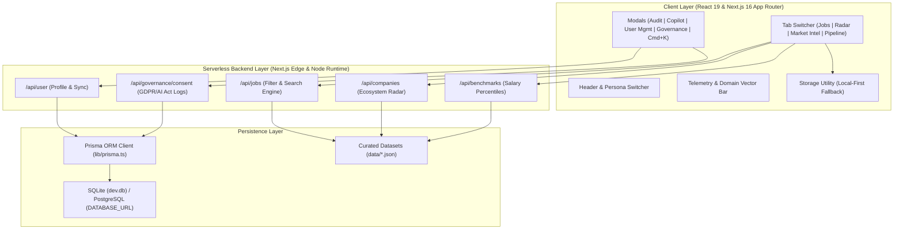

# 🛠️ Vecta Technical Handover & Architecture Specification

This document provides technical handover instructions, system architecture diagrams, data models, algorithm specifications, and operational runbooks for maintaining and extending **Vecta**.

---

## 1. High-Level System Architecture



---

## 2. Directory Structure & Key Artifacts

```
vecta/
├── app/
│   ├── layout.tsx                 # Root layout, HTML meta tags, Geist typography
│   ├── page.tsx                   # Master page orchestrator coordinating view states
│   ├── globals.css                # Light-theme design tokens, surfaces, and accessibility defaults
│   └── api/
│       ├── jobs/route.ts          # ATS job search with multi-faceted filtering
│       ├── companies/route.ts     # Company ecosystem directory endpoint
│       ├── benchmarks/route.ts    # Salary percentiles (P25-P90) & talent archetypes
│       ├── user/route.ts          # User profile synchronization with Prisma
│       └── governance/
│           └── consent/route.ts   # GDPR and EU AI Act consent logging
├── components/
│   ├── Header.tsx                 # Navigation bar, search, and active persona pill
│   ├── MetricCards.tsx            # Horizontal telemetry bar with domain vector switches
│   ├── JobBoard.tsx               # Direct ATS job search with Vector Match meters
│   ├── RadarTable.tsx             # Company directory table with expandable drawers & CSV export
│   ├── RecruiterLookup.tsx        # Compensation percentiles & talent archetype blueprints
│   ├── PipelineBoard.tsx          # Kanban board for job applications
│   ├── FitEvaluatorModal.tsx      # Vector Match & ATS parseability breakdown
│   ├── CopilotModal.tsx           # AI cover letter & STAR interview question drafter
│   ├── ProfileDrawer.tsx          # Candidate profile & skills weight editor
│   ├── UserManagementModal.tsx    # Demo persona switcher & custom user management
│   ├── GovernanceModal.tsx        # EU AI Act disclosures, GDPR data wipe/export
│   ├── ConsentBanner.tsx          # Interactive GDPR & AI Act consent banner
│   └── CommandPalette.tsx         # Global ⌘K search overlay
├── data/
│   ├── companies.json             # Verified company directory dataset
│   ├── jobs.json                  # Direct ATS job vacancies dataset
│   ├── salaryBenchmarks.json      # UK & EU compensation percentiles
│   └── talentArchetypes.json      # Talent archetypes & interview question blueprints
├── lib/
│   ├── types.ts                   # Core TypeScript interfaces & domain models
│   ├── prisma.ts                  # Singleton Prisma client instance
│   ├── fitEngine.ts               # Vector matching & ATS parseability algorithms
│   ├── copilotEngine.ts           # AI cover letter & STAR interview generators
│   └── storage.ts                 # Client-side persistence, GDPR wipe & export tools
├── prisma/
│   └── schema.prisma              # Database schema (User, Profile, Application, Consent)
└── docs/
    ├── USER_GUIDE.md              # End-user handbook for job seekers & recruiters
    ├── HANDOVER.md                # This handover document
    └── ROADMAP.md                 # Multi-phase feature roadmap
```

---

## 3. Data Models & Prisma Schema

The Prisma database schema is defined in [prisma/schema.prisma](file:///Users/stephencranfield/Projects/vecta/prisma/schema.prisma):

```prisma
model User {
  id           String        @id @default(cuid())
  email        String        @unique
  name         String
  role         String        @default("Candidate")
  avatar       String?
  isDemo       Boolean       @default(false)
  createdAt    DateTime      @default(now())
  updatedAt    DateTime      @updatedAt
  profile      Profile?
  applications Application[]
  savedJobs    SavedJob[]
  consents     ConsentLog[]
}

model Profile {
  id                String   @id @default(cuid())
  userId            String   @unique
  user              User     @relation(fields: [userId], references: [id], onDelete: Cascade)
  currentTitle      String
  primaryDomain     String   // "AI" | "Security" | "Governance" | "IT"
  yearsExperience   Int      @default(0)
  skills            String   // JSON array string
  certifications    String   // JSON array string
  targetSalaryMin   Int?
  preferredWorkMode String   @default("Hybrid")
  resumeText        String?
  updatedAt         DateTime @updatedAt
}

model Application {
  id           String   @id @default(cuid())
  userId       String
  user         User     @relation(fields: [userId], references: [id], onDelete: Cascade)
  jobId        String
  companyName  String
  jobTitle     String
  domain       String
  stage        String   @default("saved")
  notes        String?
  salaryTarget String?
  applyUrl     String?
  createdAt    DateTime @default(now())
  updatedAt    DateTime @updatedAt
}

model ConsentLog {
  id                String   @id @default(cuid())
  userId            String?
  user              User?    @relation(fields: [userId], references: [id], onDelete: Cascade)
  gdprConsent       Boolean  @default(true)
  aiActConsent      Boolean  @default(true)
  analyticsConsent  Boolean  @default(false)
  ipAddress         String?
  consentedAt       DateTime @default(now())
}
```

---

## 4. Algorithmic Specifications

### A. Vector Fit Engine (`lib/fitEngine.ts`)
The vector match algorithm evaluates candidate readiness across three weighted vectors:

$$\text{Overall Score} = (0.50 \times \text{Skills Score}) + (0.25 \times \text{Seniority Score}) + (0.25 \times \text{Domain Score})$$

1. **Skills Alignment (50%)**: Exact and substring matching against required and preferred skills in the job specification and candidate resume text.
2. **Seniority Caliber (25%)**: Evaluates candidate experience years against target role tiers (*Junior: 1+ yr, Mid: 3+ yr, Senior: 5+ yr, Lead: 7+ yr, Director: 8+ yr*).
3. **Domain Synergy (25%)**: Scores 100% for direct domain match, 85% for recognized cross-domain synergies (*AI ↔ Governance, Security ↔ Governance, IT ↔ Security*), and 60% for non-adjacent domains.

### B. ATS Keyword Health Audit
- **Quantifiable Metric Detection**: Scans resume text for percentages (`%`), financial metrics (`£`, `$`), and scale multipliers (`x`).
- **High-Impact Action Verbs**: Evaluates the presence of technical action verbs (*architected, engineered, orchestrated, audited, automated, secured, designed*).

---

## 5. Deployment & Production Setup

### A. Vercel Deployment
1. Connect the GitHub repository `https://github.com/1Zero9/vecta.git` to Vercel.
2. **Environment Variables**:
   - `DATABASE_URL`: *(Optional)* Connection string for PostgreSQL (e.g. Supabase or Neon). If not set, Vecta uses local SQLite in development and resilient client storage in static environments.
   - `NODE_ENV`: `production`
3. Build Command: `npm run build`
4. Output Directory: `.next`

### B. Database Migrations for PostgreSQL (Production)
When switching from SQLite to PostgreSQL in production:
1. Update `provider = "postgresql"` in `prisma/schema.prisma`.
2. Run migration:
   ```bash
   npx prisma migrate dev --name init_postgres
   ```

---

## 6. Maintenance & Troubleshooting Runbook

| Scenario | Diagnosis & Action |
| :--- | :--- |
| **Prisma Client Out of Sync** | Run `npx prisma generate` followed by `npx prisma db push`. |
| **Reset Local Database** | Delete `prisma/dev.db` and run `npx prisma db push` to recreate clean schema. |
| **Reset Client Data** | Use the **"Wipe All My Data"** button in the Governance Modal or call `wipeAllUserData()` in `lib/storage.ts`. |
| **Adding New ATS Feed** | Append company entries to `data/companies.json` and job listings to `data/jobs.json`. |
| **Production Build Failure** | Run `npm run build` locally to inspect TypeScript compilation output. |
