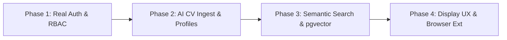

# 🗺️ Vecta Future Feature & Architecture Roadmap

This roadmap outlines planned enhancements, architectural milestones, and feature specifications for **Vecta** across four core development phases.

---

## 📅 Roadmap Overview

---

## 🔐 Phase 1: Authentication, Real Logins & Multi-Tenant RBAC

### 1.1 Social OAuth & Passwordless Logins
- **Integration**: Implement **Auth.js (NextAuth v5)** or **Supabase Auth** for seamless authentication.
- **Providers**:
  - **LinkedIn OAuth**: 1-click login for candidates and recruiters.
  - **GitHub OAuth**: Developer authentication with automatic repository discovery.
  - **Google OAuth**: Fast single sign-on (SSO).
  - **Magic Links**: Passwordless email authentication for enterprise GRC auditors.

### 1.2 Multi-Tenant Role-Based Access Control (RBAC)
- **Roles**:
  - `CANDIDATE`: Access to job search, vector matching, tailored applications, and personal career pipeline.
  - `RECRUITER`: Access to salary benchmarks, talent archetypes, candidate outreach packs, and company hiring velocity telemetry.
  - `ENTERPRISE_AUDITOR`: Access to compliance reporting, algorithmic risk assessment logs, and ISO 42001 verification packs.
  - `SUPER_ADMIN`: Directory management, ATS scraper health monitoring, and system metrics.

---

## 📄 Phase 2: Dynamic Profiles & AI CV Ingestion

### 2.1 PDF & DOCX Resume Parsing
- Drag-and-drop resume upload (`.pdf`, `.docx`).
- Automated OCR and LLM-powered entity extraction parsing:
  - Technical skills, tools, and frameworks.
  - Certifications (*CISSP, CKA, IAPP AIGP, AWS ML Specialty*).
  - Employment timeline, titles, and quantifiable accomplishments.
- Automatic vector profile synchronization upon upload.

### 2.2 Verifiable Credentials & Portfolio Embeds
- **Credly & Acclaim API Integration**: Automatically verify and display authentic certification badges.
- **GitHub Repository Analysis**: Inspect public repositories to compute verified skill confidence scores (e.g. *Python AST analysis, Kubernetes manifests, Terraform modules*).

---

## 🔍 Phase 3: Advanced Filtering & Semantic Vector Search

### 3.1 Semantic pgvector Embedding Search
- Replace substring keyword search with high-dimensional vector embeddings (`text-embedding-3-small` or local embeddings).
- Search with natural language queries:
  - *"Senior roles building low-latency LLM inference pipelines with vLLM in London"*
  - *"GRC positions requiring EU AI Act and DORA audit readiness"*
- Cosine similarity ranking between candidate resume embeddings and job description embeddings.

### 3.2 Advanced Search Facets & Exclusion Filters
- **Salary Percentile Sliders**: Filter by target P50/P75 percentiles with multi-currency toggle (£ GBP, € EUR, $ USD).
- **Negative / Exclusion Filtering**: Exclude specific technologies or companies (*e.g. "Python without Java", "Exclude enterprise FDI"*).
- **Hybrid Office Distance Radius**: Commute radius filtering based on postal code/city proximity.

---

## 🖥️ Phase 4: Enhanced Display, Visualizations & Extensions

### 4.1 Compact Table vs. Rich Card Display Toggle
- Add a view switch allowing users to toggle between:
  - **Rich Card View**: Maximum context, AI fit gauges, and quick action buttons.
  - **Compact Table / Dense View**: High-density scanning for power users with keyboard navigation shortcuts (`J`/`K` navigation, `Space` to preview).

### 4.2 Interactive Market Salary Heatmaps & Distribution Charts
- Replace static percentile progress bars with interactive **Chart.js / Recharts** distribution bell curves showing salary spreads across seniority tiers and locations.
- Cost of living vs. compensation purchasing power calculators.

### 4.3 Real-Time ATS Webhook Scrapers & Schedulers
- Automated cron jobs that scan Greenhouse, Ashby, Lever, and Workable APIs daily to auto-ingest new vacancies and retire closed postings.

### 4.4 Chrome & Edge Browser Extension
- Browser extension companion that allows candidates to:
  - 1-click capture any job description directly from LinkedIn or company careers pages into their Vecta Kanban pipeline.
  - View instant Vector Match score and generate tailored cover letters directly within the browser side panel.

---

## 📊 Feature Priority & Implementation Schedule

| Feature | Phase | Target Timeline | Complexity | Priority |
| :--- | :---: | :---: | :---: | :---: |
| **Auth.js OAuth & Logins** | Phase 1 | Q4 2026 | Medium | 🔴 High |
| **PDF Resume Ingest** | Phase 2 | Q4 2026 | Medium | 🔴 High |
| **Compact Table View Toggle** | Phase 4 | Q1 2027 | Low | 🟡 Medium |
| **Semantic pgvector Search** | Phase 3 | Q1 2027 | High | 🟡 Medium |
| **Real-Time Scraper Cron** | Phase 4 | Q2 2027 | High | 🟡 Medium |
| **Chrome Extension** | Phase 4 | Q2 2027 | Medium | 🟢 Low |
